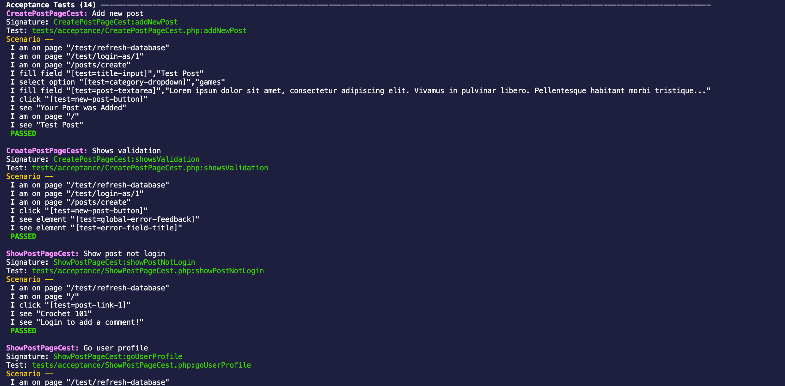
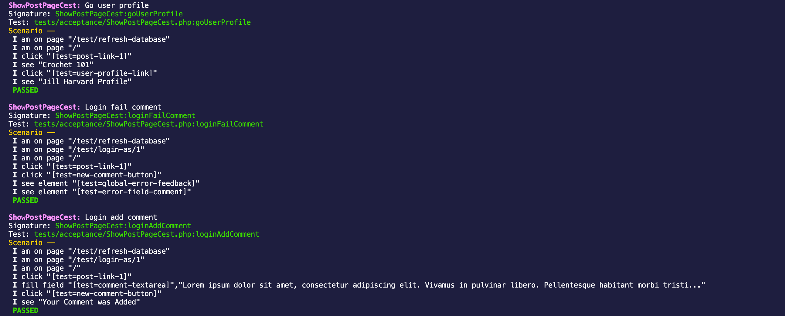
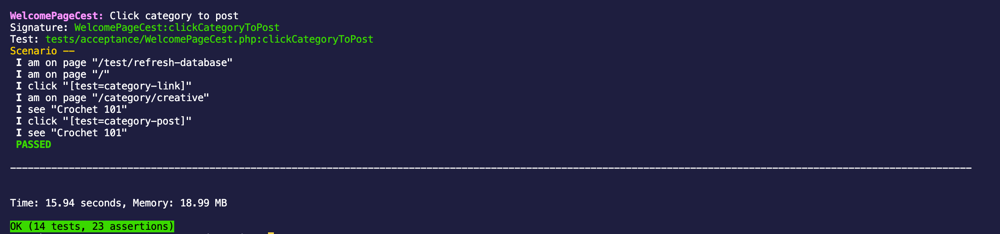

# Project 3: Hobbyist Blog
+ By: Paula Leal Funes
+ Production URL: http://e15p3.lefthandedcat.me/
+ Login as Jill Harvard or Jamal Harvard using the password: asdfasdf

## Feature summary
+ All Users can view individual posts and related comments 
+ Visitors can register/log in
+ Only Users with accounts can create and delete their own posts and comments
+ Each User has a public profile page which has a short bio that for now is pre-written in the blade template and displays the User's latest posts from descending order 
+ The home page features
  + shows a list of latest posts from descending order
  + a list of categories, with a link to each category that shows a page of posts (with links) within that category

  
## Database summary
*Describe the tables and relationships used in your database.*

+ My application has 3 tables in total (`users`, `posts`, `comments`)
+ There's a many-to-many relationship between `users` and `posts`
+ There's a many-to-many relationship between `users` and `comments`
+ There's a one-to-many relationship between `posts` and `comments`
+ There's a one-to-many relationship between `posts` and `users`

## Outside resources
* [Delete a user relationship from one-to-many relationship9](https://stackoverflow.com/questions/49323458/can-detach-method-also-be-applied-to-one-to-many-relationship-in-laravel)
* [Solved 'Cannot delete or update a parent row: a foreign key constarint fails' Error](https://laravel.com/docs/5.1/migrations#foreign-key-constraints)

## Tests

